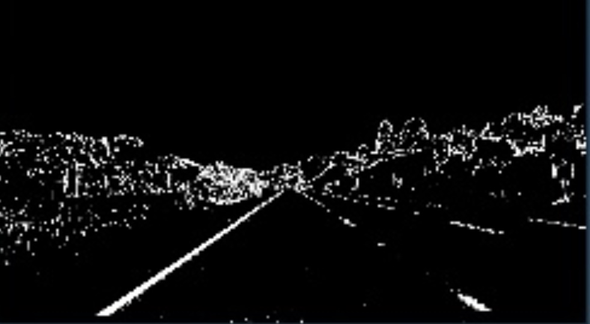
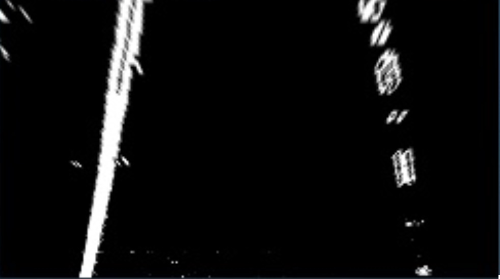
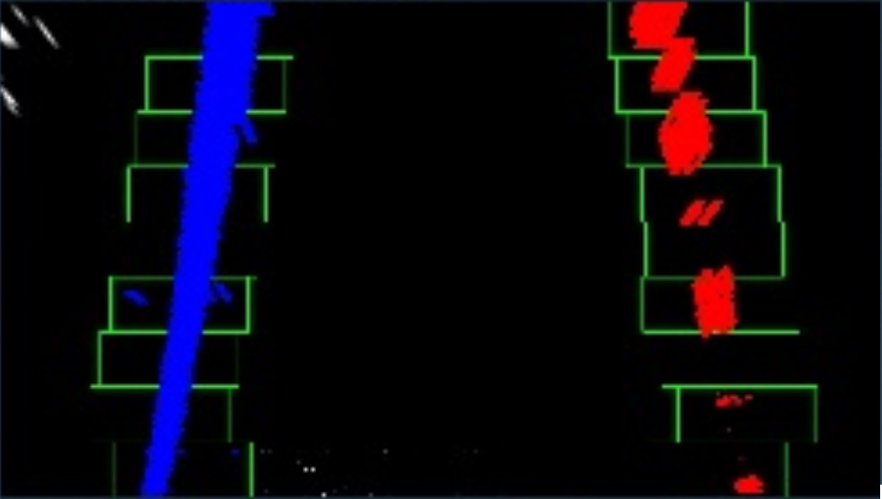
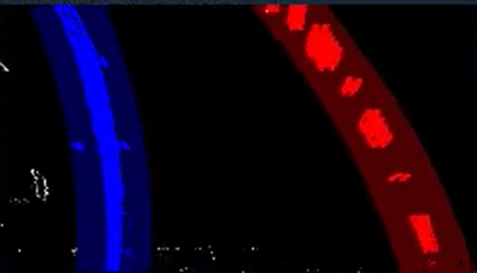
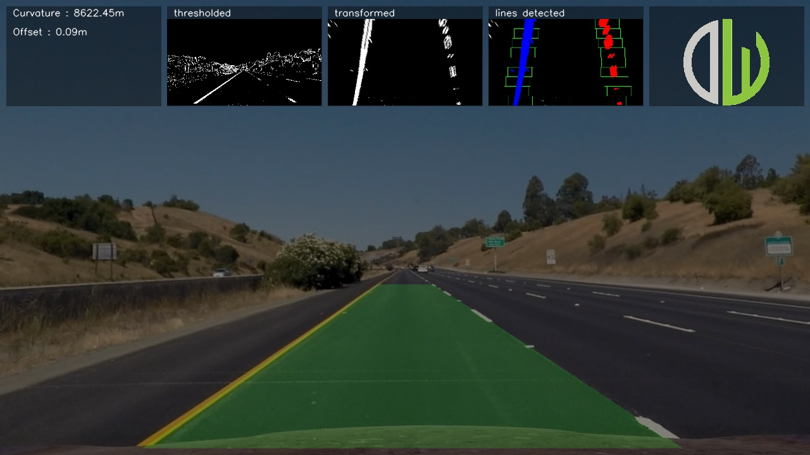

# Advanced Lane Finding

[](https://www.youtube.com/watch?v=vn48abobflA) 

*click on the image to play the video*

## Project Organization

    ├── README.md          <- The top-level README for developers using this project.
    ├── data
    │   ├── external       <- Data from third party sources.
    │   ├── interim        <- Intermediate data that has been transformed.
    │   ├── processed      <- The final, canonical data sets for modeling.
    │   └── raw            <- The original, immutable data dump.
    │
    ├── requirements.txt   <- The requirements file for reproducing the analysis environment, e.g.
    │                         generated with `pip freeze > requirements.txt`
    │
    └── src                <- Source code for use in this project.

## Installation
I suggest to create an new virtual (python) environment with `mkvirtualenv`, and then install the dependencies with.
```bash
pip install -r requirements.txt
```

## Usage
Run the python file `src/find_lane_lines.py`. It requires an input path which can be a video or image. In the `data/raw/` are some `test_videos` and `test_images`. You can use the flag `-v, --verbose` to let the application be more explicit. You can use the flag `-s, --show` to show the live process on video's.
```bash
python src/find_lane_lines.py data/raw/test_videos/project_video.mp4 -s -v
```

## Project description
The goals / steps of this project are the following:

* Compute the camera calibration matrix and distortion coefficients given a set of chessboard images.
* Apply a distortion correction to raw images.
* Use color transforms, gradients, etc., to create a thresholded binary image.
* Apply a perspective transform to rectify binary image ("birds-eye view").
* Detect lane pixels and fit to find the lane boundary.
* Determine the curvature of the lane and vehicle position with respect to center.
* Warp the detected lane boundaries back onto the original image.
* Output visual display of the lane boundaries and numerical estimation of lane curvature and vehicle position.

## Pipeline

### Camera calibration
Before the application applies the `pipeline` to the image or video it checks attempts to load the camera calibration matrix. If the matrix is not available, it will generate one based on the images in `data/raw/calibration`.

```python
# src/camera.py > __init__

# check if the camera_matrix exists
if not os.path.exists(self.matrix_file):
    self.generate_calibration_matrix()

# load the calibration matrix
self.load_calibration_matrix(image_size)
```

Now we can apply the same pipeline on an image or every frame in an video.

```python
# src/find_lane_lines.py > pipeline

# Distortion correction
undist = camera.undistort(image)

# Color/gradient threshold
thresholded = threshold.color_and_gradient(undist)

# Perspective transform
warped = transform.perspective(thresholded)

# Detect lane lines
lines, curvature, offset = lane.detect_lines(warped)

# draw the lane
output = lane.draw(warped, undist, transform)

# enrich the frame
output = enrich(output, curvature, offset, thresholded, warped, lines)
```

### Distortion correction
The distorion correction will apply the camera matrix on every image, which will correct for any camera distortions.

```python
cv2.undistort(image, self.camera_matrix, self.distortion_coefficients, None, None)
```

### Color/gradient threshold
First i'll convert the image from `RGB` formal to `HLS` format. Now i can use the `saturation` channel to create an binary image with all zero's except for the pixels where the saturation lays within my thresholds.

```python
# src/threshold.py > color_and_gradient

# Convert to HLS color space and separate the V channel
hls = cv2.cvtColor(image, cv2.COLOR_RGB2HLS)
s_channel = hls[:,:,2]

# Threshold color channel
color_binary = np.zeros_like(s_channel)
color_binary[(s_channel >= self.color_threshold[0]) & (s_channel <= self.color_threshold[1])] = 1
```

Since i've allready converted the image to the `HLS` format, i can use the `lightness` channel as input for my (sobel) horizontal edge detector. Now i can create an binary image with all zero's except for the pixels where there is an edge. 

```python
# src/threshold.py > color_and_gradient

l_channel = hls[:,:,1]

# Sobel x
sobelx = cv2.Sobel(l_channel, cv2.CV_64F, 1, 0) # Take the derivative in x
abs_sobelx = np.absolute(sobelx) # Absolute x derivative to accentuate lines away from horizontal
scaled_sobel = np.uint8(255 * abs_sobelx / np.max(abs_sobelx))

# Threshold x gradient
gradient_binary = np.zeros_like(scaled_sobel)
gradient_binary[(scaled_sobel >= self.gradient_threshold[0]) & (scaled_sobel <= self.gradient_threshold[1])] = 1
```

Now i combine the 2 binary images to 1 binary image, which highlights bright colors and edges.

```python
# src/threshold.py > color_and_gradient

# Combine the two binary thresholds
combined_binary = np.zeros_like(gradient_binary)
combined_binary[(color_binary == 1) | (gradient_binary == 1)] = 255
```



### Perspective transform
Now that i have an binary image with the lines activated (by color or by gradient), i can warp it to an top-down perspective. Before i can do this, i need to pick some source `src` points from the binary image, and some destination `dst` points to warp to. After this is done, i can calculate and transformation matrix, and also calculate the invers matrix (for warping back afterwards).

```python
# src/transform.py > __init__

# calculate the perspective transform matrix
self.matrix = cv2.getPerspectiveTransform(src, dst)

# calculate the INVERSE perspective transform matrix
self.inverse_matrix = cv2.getPerspectiveTransform(dst, src)
```

Now i can apply the matrix to the binary image to warp the image.

```python
# src/transform.py > perspective

cv2.warpPerspective(image, self.matrix, (self.width, self.height))
```



### Detect lane lines
Now we have a top-down view of the road ahead. Now we can search for the lane lines. We have 2 approaches `sliding_windows` and `previous_fits`. The `sliding_windows` approach is more slowly, but it's more robust so it's a good fallback. The `previous_fits` is faster, but it depends on information from the previous frame.

```python
# src/lane.py > detect_lines

if self.left_line.detected and self.right_line.detected:
    out_img = self.previous_fits(binary_image)
else:
    out_img = self.sliding_windows(binary_image)
```

The `sliding_windows` approach first looks at the bottom half and generates an histogram of all pixels. Because it's a binary image and its warped, it highly likely that the histogram generates 2 peaks. The x positions (`left`, `right`) of the peaks are used as initial coordinations of the sliding windows. The sliding windows start at the bottom with the initial coordinates as center. In the window all `nonzero` pixels are collected and the mean x position is calculated. This `mean x` position is used as center for the next window.

Now that we have the selected pixels for the line, we can fit a polynomial on it. 

```python
# src/lane.py > sliding_windows
```



The slinding window approach is flexible and robust, but is't also quite slow, because it applies a blank search each frame. In the `previous_fits` approach we use the polynomial from the previous frame and add a search `bandwidth` around it to look for nonzero pixels.

Now that we have the selected pixels for the line, we can fit a polynomial on it. 

```python
# src/lane.py > previous_fits
```



Now that we have found the lane lines and converted them to polynomals, we can use this information to calculate the curvature of the lane. And since we now know the position of the lane, we can determine it's center and how that corresponds to the center of the image. 

```python
# src/lane.py > detect_lines

# calculate the curvature
curvature = np.mean([
    self.left_line.radius_of_curvature,
    self.right_line.radius_of_curvature
])

# calculate the offset
offset = self.calculate_offset(binary_image)
```

### draw the lane

Now that we have found the line polynomials, we can use it calculate the points of both lines, and use thes points to draw a filled polygon in an black `warped` image. Now the `inverse_matrix` from `transform` comes in handy in order to "unwarp" the black lane image. Now we can merge the black lane image as an "overlay" on the undistorted image. et voila we have a lane annotated.

```python
# src/lane.py > draw

# Create an image to draw the lines on
warp_zero = np.zeros_like(warped).astype(np.uint8)
color_warp = np.dstack((warp_zero, warp_zero, warp_zero))

# Recast the x and y points into usable format for cv2.fillPoly()
pts_left = np.array([np.transpose(np.vstack([self.left_line.calculate_polynomial(), self.ploty]))])
pts_right = np.array([np.flipud(np.transpose(np.vstack([self.right_line.calculate_polynomial(), self.ploty])))])
pts = np.hstack((pts_left, pts_right))

# Draw the lane onto the warped blank image
cv2.fillPoly(color_warp, np.int_([pts]), (0,255, 0))

# Warp the blank back to original image space using inverse perspective matrix (Minv)
newwarp = cv2.warpPerspective(color_warp, transform.inverse_matrix, (undist.shape[1], undist.shape[0])) 

# Combine the result with the original image
return cv2.addWeighted(undist, 1, newwarp, 0.3, 0)
```

### enrich the frame

The last (extra) step that i've added to the pipeline is to enrich the output image. It adds several (UI) boxes to the output, where in the first box the lane `curvature` and `offset` are showed. The next 3 boxes are the interim images of some stages. In the last box i've had the ambition to add my profile picture, but due to lack of time i've kept it at the company logo i work for.

```python
# src/find_lane_lines.py > enrich

 # draw some background boxes
image, boxes = draw_boxes(image)

# add some text
image = put_text(image, f'Curvature : {curvature:.2f}m', (boxes[0][0][0] + 10, boxes[0][0][0] + 15))
image = put_text(image, f'Offset : {offset:.2f}m', (boxes[0][0][0] + 10, boxes[0][0][0] + 45))
image = put_text(image, 'thresholded', (boxes[1][0][0] + 10, boxes[0][0][0] + 15))
image = put_text(image, 'transformed', (boxes[2][0][0] + 10, boxes[0][0][0] + 15))
image = put_text(image, 'lines detected', (boxes[3][0][0] + 10, boxes[0][0][0] + 15))

# add the images
image = picture_in_picture(image, thresholded, boxes[1], 2)
image = picture_in_picture(image, warped, boxes[2], 2)
image = picture_in_picture(image, lines, boxes[3])
image = picture_in_picture(image, dataworkz, boxes[4], 4)
```



## Discussion
There are many flaws in this code, and i think i know how to fix them. But the deadline of this project is tomorrow. so instead of solving them i mention them. 
- currently only the first frame applies `sliding_windows` and all consecutive frames apply the `previous_fits` approach, because the line.detected is set to `True` and never set to `False`. I've had trouble figuring out when and how to set them to `false`.
- I've tried to set the top of the `src` vertices for the warping higher, so i could look futher ahead. I hoped to find more stable lines in the different video's but the lines ended up more unstable.
- i don't know how i would approach the very tight bend in the `harder_challenge_video.mp4` video. I think the `sliding_windows` doesn't work, the `previous_fits` should be more suitable. but the warp matrix will crop the image to much (i think) to get the pixels.

i realy wanted to go above and beyound at this project. but there is so much ahead that i leave it at this. (for now)