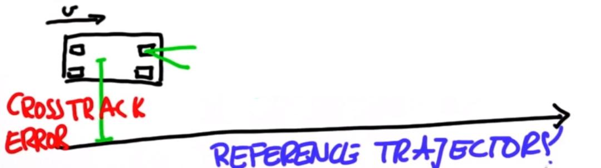
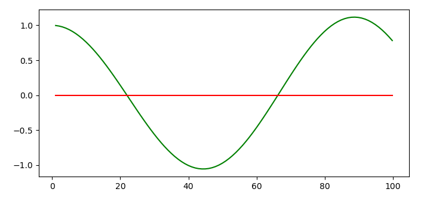
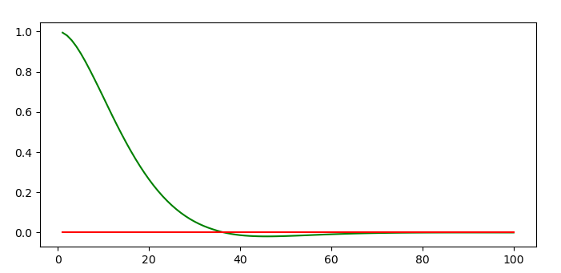
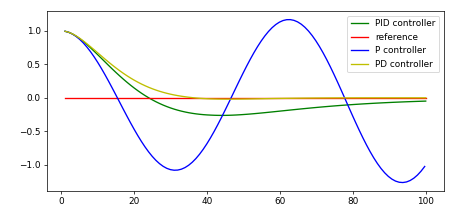

# CarND-Controls-PID
Self-Driving Car Engineer Nanodegree Program

---

## Dependencies

* cmake >= 3.5
 * All OSes: [click here for installation instructions](https://cmake.org/install/)
* make >= 4.1(mac, linux), 3.81(Windows)
  * Linux: make is installed by default on most Linux distros
  * Mac: [install Xcode command line tools to get make](https://developer.apple.com/xcode/features/)
  * Windows: [Click here for installation instructions](http://gnuwin32.sourceforge.net/packages/make.htm)
* gcc/g++ >= 5.4
  * Linux: gcc / g++ is installed by default on most Linux distros
  * Mac: same deal as make - [install Xcode command line tools]((https://developer.apple.com/xcode/features/)
  * Windows: recommend using [MinGW](http://www.mingw.org/)
* [uWebSockets](https://github.com/uWebSockets/uWebSockets)
  * Run either `./install-mac.sh` or `./install-ubuntu.sh`.
  * If you install from source, checkout to commit `e94b6e1`, i.e.
    ```
    git clone https://github.com/uWebSockets/uWebSockets 
    cd uWebSockets
    git checkout e94b6e1
    ```
    Some function signatures have changed in v0.14.x. See [this PR](https://github.com/udacity/CarND-MPC-Project/pull/3) for more details.
* Simulator. You can download these from the [project intro page](https://github.com/udacity/self-driving-car-sim/releases) in the classroom.

Fellow students have put together a guide to Windows set-up for the project [here](https://s3-us-west-1.amazonaws.com/udacity-selfdrivingcar/files/Kidnapped_Vehicle_Windows_Setup.pdf) if the environment you have set up for the Sensor Fusion projects does not work for this project. There's also an experimental patch for windows in this [PR](https://github.com/udacity/CarND-PID-Control-Project/pull/3).

## Basic Build Instructions

1. Clone this repo.
2. Make a build directory: `mkdir build`
3. Run it: `./compile_and_run.sh`. (it's conviniant)

## Project Instructions and Rubric

The goal of this project was to let the car drive around the track without running of the road. The only input we'll recieve is the `crosstrack_error` (`cte`). This is the distance from the center from the car to the center of the road. So we want a controller that minimizes the distance (`cte`).



### PID controller
I've build an PID controller in order to achieve the goal. The PID controller stands for **Proportional Integral Differential**. Let's break it down.

#### Proportional
If we want to minimize the `cte` we'll have to adjust the steering angle towards the center of the road. We can't use a fixed steering angle because this would steer the car in circles. No we need a dynamic value that adjusts constantly based on the `cte`. If we'll use the `cte` value itself to steer, than we steer directly towards the center of the road. This means that the car tries to steer sharper than it's fysical limits, and the ride would be very unpleasant. No if we can multiply the `cte` with some value, the steering will be smoother. Let's call this value `Kp`. 

> P = -Kp * cte
> 
> steering_angle = P

If we implement this to our car the ride would look like this:



The ride would definitly be smoother, be the car is always oscilating towards the center of the road. That's in my opinion not a comfortable ride. If only we've had something to fix this.

#### Differential
The problem of the proportional part is that it's reactive. It's steers toward the center of the road, but it doesn't change when i comes in the neighbourhood of the center. If we look at the proportional formula, the `cte` will be the largest on the borders of the road and the smallest at the center, but when the `cte` is low, the `Kp` is still a fixed value and thus will maintain the steering angle. 

We need to adjust the steering angle when we approach the center of the road. If we'll use the difference from the previous `cte` to the current `cte` and we subtract that from the angle, than the car would still overshoot the center, but after a while the car will reach the center of the road. This is because the difference between the 2 `cte`'s is relativly small compared to the proportional part. So if we muliply the difference with a 'big' value the car would less overshoot and drive more smoothly towards the center. Let's call this 'big' value `Kd`. 

> P = -Kp * cte
> 
> D = Kd * (cte - cte_prev)
> 
> steering_angle = P - D

If we implement this to our car the ride would look like this:



Much better.. So what does the integral part do then?

#### Integral
The Integral part counters for the `systematic bias`. Suppose the car mechanic that mounted the wheels didn't align the wheel properly, So there is now a small steering offset. If we don't counter for this the car will never reach the center of the road (because of the offset) and the `cte` will remain large. What we need to do is to 'learn' to counter for the offset. 

We'll do this by calculating the sum of all `cte`'s we've seen so far. If there is no `systematic bias` the car will steer towards the center and thus the sum of all `cte` will become relativly small. But it there is a `systematic bias` than the sum of all `cte`'s well become higher and higher. If we now directly subtract the sum from the P & D values, this will result in strong steering angles. So again let's add an 'small' `Ki` value to multuply the sum.

> P = -Kp * cte
> 
> D = Kd * (cte - cte_prev)
> 
> I = Ki * sum(ctes)
> 
> steering_angle = P - D - I

So now the car always drives towards the center including a `systematic bias`.



### Twiddle
Ok that's great but what (`Kp`, `Ki`, `Kd`) values do i need to enter to get the PID controller to drive smoothly? We can fiddle around until we find the best settings for our car, or we can use `Twiddle`. `Twiddle` is basically a hyperparameter search that brute forces into a local optimum. It runs many times, where in each run, it measures how "good" the run is. If the run is not good it will adjust the hyperparameters based on some potential changes.

I can try to explain it, but i find Sebastians very good.


## Implementation
Now i'll discuss how i've implemented the PID controller into the car.

### PID controller
I started by implementing the PID algorithm. This was fairly easy, because the boilerplate c++ code was quite complete. I chose to use the `Kp`, `Ki`, `Kd` values from the PID control lesson as a starting point. The car drove a bit but went of track, so adjusted the values and fiddled a little bit with them. But this didn't got me very far so i chose to implement the twiddle algorithm.

### Twiddle
I've implemented the twiddle algorithm after quite a struggle. I'm more a python programmer than a c++ programmer, so i've tried to stay as true to the python implementation as possible. 

My first attempts where with the initial parameters set at 0,0,0. I noticed that while the twiddle algorithm was seaching the errors got worse. After a while the error improves. 

Occasionally the car drove of the track, or got stuck in a ditch. So i've implemented an check that if the `cte` becomes larger than 4 the simulator will reset, and we go for a new run.
```c++
// Of the road (restart)
if (abs(cte) >= 4) {
  // notify whats happening
  std::cout << "of the road > restart simulator" << std::endl;

  // reset the values
  steer_value = 0;
  throttle = 0.1;
  counter = 0;

  // trigger the reset
  std::string msg("42[\"reset\", {}]");
  ws.send(msg.data(), msg.length(), uWS::OpCode::TEXT);
}
```

I've also noticed that the car keeps on accelerating until it's max speed. This is fine, but during the hyperparameter search (i call it `twiddling`) i find it stressfull, so i've limited the speed to 5 mph.
```c++
if (speed > 5) {
  throttle = 0;
}
```

`twiddling` takes serveral runs in order to improve the parameters and achieve a the tolerance. I've noticed that sometimes the Udacity workspace crashes (or the network failed, or something else). But i lost quite some runs, and had to start over. Therefore i've added a logger, that writes the parameters to a file. If something failed, i can resume with the most recent parameters
```c++
void Twiddle::log() {
  // define some streams
  ofstream foutput; 
  ifstream finput;
  finput.open ("twiddle.log");
  foutput.open ("twiddle.log",ios::app); 

  // write the current coefficients to a file.
  if(finput.is_open()) {
    foutput << "Kp:" << p[0] << ", Ki:" << p[1] << ", Kd:" << p[2] << ", sum:" << sum << std::endl;
  }

  // close the streams
  finput.close();
  foutput.close(); 
}
```

### Fin
After quite some fiddling (twiddling), i found that
```c++
double Kp = 0.15;  
double Ki = 0.001;
double Kd = 0.8;
```
were the best parameters for my car. So i've added a status flag to my twiddle implementation, which stops the twiddling and drops the speed limit.